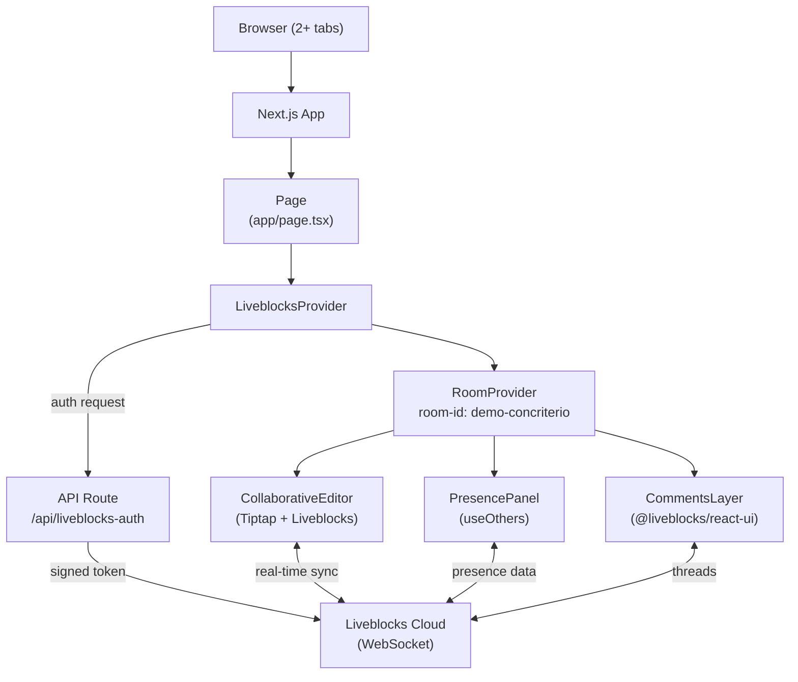

# Arquitectura — Liveblocks Demo

## Stack elegido: Next.js 15 + App Router

**Justificación:** Liveblocks requiere un endpoint de autenticación en servidor
para generar tokens de acceso a las rooms. Next.js App Router permite colocar ese
endpoint en `/app/api/liveblocks-auth/route.ts` sin necesidad de un servidor
separado. El cliente usa React Server Components solo para el shell de la página;
toda la lógica colaborativa es cliente (`"use client"`).

Astro se descartó porque `@liveblocks/react` está diseñado para React puro y el
modo islands de Astro complica la propagación del `LiveblocksProvider` global.

## Diagrama de componentes



## Estructura de carpetas

```
liveblocks-concriterio-tools/
├── app/
│   ├── api/
│   │   └── liveblocks-auth/
│   │       └── route.ts          ← Endpoint autenticación (LIVEBLOCKS_SECRET_KEY aquí)
│   ├── layout.tsx                ← Shell HTML, fuentes, metadata
│   └── page.tsx                  ← Página principal de la demo
├── components/
│   ├── CollaborativeEditor.tsx   ← Tiptap + @liveblocks/react-tiptap
│   ├── PresencePanel.tsx         ← useOthers, avatares
│   ├── BannerConsultoria.tsx
│   ├── BannerNewsletter.tsx
│   ├── BannerRepositorio.tsx
│   └── StackSection.tsx
├── lib/
│   └── liveblocks.ts             ← createClient + tipos globales
├── public/
├── .env.example
├── .env.local                    ← No en git
├── tailwind.config.ts
├── next.config.ts
└── package.json
```

## Integraciones externas

| Servicio | Uso | Credencial |
|---|---|---|
| Liveblocks Cloud | WebSocket rooms, presencia, comentarios | `LIVEBLOCKS_SECRET_KEY` (servidor) + `NEXT_PUBLIC_LIVEBLOCKS_PUBLIC_KEY` (cliente) |

## Estrategia de protección de API keys

- `LIVEBLOCKS_SECRET_KEY`: solo en el API route de autenticación. Nunca importado en componentes cliente.
- `NEXT_PUBLIC_LIVEBLOCKS_PUBLIC_KEY`: expuesto en cliente intencionadamente (es la clave pública de Liveblocks, por diseño).
- El API route valida la identidad del usuario (simulada en esta demo) y genera un token firmado antes de devolverlo al cliente.

## Configuración Vercel

- Framework: Next.js (detección automática)
- Variables de entorno: `LIVEBLOCKS_SECRET_KEY`, `NEXT_PUBLIC_LIVEBLOCKS_PUBLIC_KEY`
- No se requieren configuraciones adicionales de build
